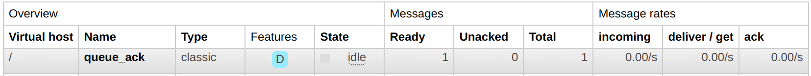

# 知识：RabbitMQ 的 “消息确认” 特性

## 1. 概述

RabbitMQ的 “消息确认（Message Acknowledgment）” 特性是指消费者在接收和处理消息后，向 RabbitMQ 发送确认消息，以告知 RabbitMQ 该消息已经被成功处理。消息确认是一种重要的机制，用于确保消息在传递过程中的可靠性和完整性。它有助于防止消息丢失或重复处理，并确保消息能够正确地被消费者处理。

RabbitMQ 提供了两种消息确认模式：

- 自动消息确认模式（Auto Acknowledgment Mode）： 也称为 “自动确认”，在这种模式下，RabbitMQ 会在将消息分发给消费者后立即将其标记为已确认，而无需消费者显式地发送确认消息。这种模式下存在消息丢失的风险，因为如果消费者在处理消息期间发生异常或崩溃，消息将被视为已成功处理，而实际上可能并未完成处理。
- 手动消息确认模式（Manual Acknowledgment Mode）： 也称为 “手动确认”，在这种模式下，消费者在处理完消息后必须显式地向 RabbitMQ 发送确认消息。通过手动确认模式，可以确保消费者只确认已经成功处理的消息，并对处理失败的消息进行适当的处理。
    - 可以通过调用 `channel.ack(msg)` 方法发送确认消息，告知 RabbitMQ 该消息已成功处理。
    - 如果消费者无法处理消息或处理失败，可以调用 `channel.nack(msg)` 方法来拒绝消息。
    - 可以通过 `channel.reject(msg)` 方法来拒绝并丢弃消息。
    - 如果消费者在没有发送 ack 的情况下死亡（其通道关闭、连接关闭或 TCP 连接丢失），RabbitMQ 会将消息重新排队。如果同时有其他消费者在线，那么它会快速将其重新传递给另一个消费者。
    - 消费者交付确认时强制执行超时（默认为 30 分钟）。

## 2. 体验

1. 生产消息（[producer.js](producer.js)）

```shell
$ node ./producer.js
消息已发送：Hello
```

2. 消费消息（[consumer.js](consumer.js)）

```shell
$ node ./consumer.js
等待消息中...
收到消息: Hello
```

3. 由于消费者没有应答消息，所以该消息一直是未应答状态：


4. 终止消费者进程，消息会被重新排队：



5. 再次启动消费者，仍然可以消费该消息

```shell
$ node ./consumer.js
等待消息中...
收到消息: Hello
```
