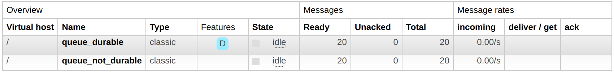
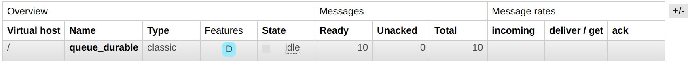

# 知识：RabbitMQ 的 “持久化” 特性

## 1. 概述

RabbitMQ 的 “持久化”（Durability）特性用于保证消息的可靠性，确保即使在发生故障或重启后仍然不会丢失。主要有以下几个方面：

- 队列的持久化： 当你声明一个队列时，可以通过将队列标记为持久化的。这样，即使 RabbitMQ 服务器重启，队列也会被保留下来。
- 消息的持久化： 在发布消息时，可以通过标记消息为持久化的。这样，消息将被写入磁盘并在发生故障后仍然可用。
- 消息确认模式： 参见 [RabbitMQ 的 “消息确认” 特性>>](../msg-acknowledgment)

## 2. 体验

1. 声明队列并生产消息（[producer.js](producer.js)）

```shell
$ node ./producer.js
声明持久化队列： queue_durable
声明非持久化队列： queue_not_durable
成功向两个队列发送 10 条持久化消息
成功向两个队列发送 10 条非持久化消息
```

2. 此时可以看到队列中积压了 20 条消息：



3. 此时重启 RabbitMQ：

```shell
$ sudo docker restart rabbitmq
```

4. 不持久化的队列和消息都消失了：


