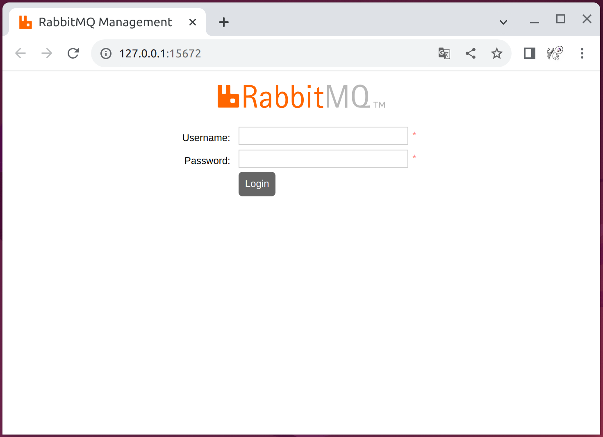

# 使用 Docker 安装 RabbitMQ 社区版（带管理界面）

使用 Docker 安装 RabbitMQ 时，一般会选择带有 “`-management`” 后缀的版本，这类版本提供了一个用户界面，称为 RabbitMQ Management 插件或 RabbitMQ Web UI，该界面允许通过 Web 浏览器查看和管理队列、交换机、绑定、用户权限等。

1. 安装

```shell
$ sudo docker run --name rabbitmq -p 5672:5672 -p 15672:15672 -d rabbitmq:3.12-management

Unable to find image 'rabbitmq:3.12-management' locally
3.12-management: Pulling from library/rabbitmq
b237fe92c417: Pull complete 
d121c94d569e: Pull complete 
b2f228d5111c: Pull complete 
8370a0f4d129: Pull complete 
e6e68a7d558a: Pull complete 
629c5382798c: Pull complete 
4987bd7482be: Pull complete 
2ef37e86206a: Pull complete 
81ec2d28a9b4: Pull complete 
4dd7e0919714: Pull complete 
6e6b99fa65c9: Pull complete 
Digest: sha256:753665ae3170bcbd66571cff9a93eb48fea90e59701e6db1fa346fa2ea7a3d7b
Status: Downloaded newer image for rabbitmq:3.12-management
0b8b89afe37dd02bb59b6a27760b3e66d446049c40626757b2fa55c4bc29932d
```

2. 浏览器打开管理界面 [`http://127.0.0.1:15672`](http://127.0.0.1:15672)，账号密码默认都是 guest，如下图所示：


